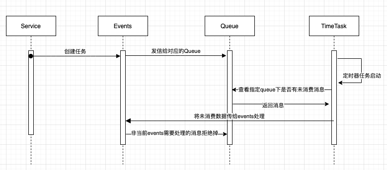

# 一点点小小的说明

| 创建人   | 创建时间   | 内容                                                    |
| :------- | :--------- | :------------------------------------------------------ |
| adsionli | 2022-04-18 | 基于 express 开发的完整框架实现内容及想要实现内容的说明 |

> 写这个项目的最大的初衷就是为了应对 2022 年 7 月即将开始的秋招，已经研二了，没办法呀，在研一的时候由后端转向前端开发，但是又不放下关于后端内容，所以就捣鼓了一段时间的 node 开发，并且在研究生的一个可视化项目中，使用 express 开发了系统的后端内容，因为东西不多，刚好练手了，现在开题报告做完了，有一段相对空闲的 时间来弄一下自己的东西了，所以就把一些学习到的内容，以及自己想要实现的内容都在这个项目里面写一下，当然这个项目也是有对应的前端内容的，因为没有使用场景的干写，肯定是不太行的，虽然这里还是有很多的是模拟的场景，在单体应用里可有可无的，但是还是想要走通，来完成相关的内容。

# 模块设计

| 编号 | 模块名称               | 模块内容说明                                                                                                                           |
| :--- | :--------------------- | :------------------------------------------------------------------------------------------------------------------------------------- |
| 1.   | 自动化路由加载         | 无须再通过 express 的 router 文件夹下去创建相关 router，直接通过读取指定后缀的文件，自动提取其中内容，完成路由表的构建                 |
| 2.   | 基于自身需要实现的 orm | 数据库常用操作的封装以及相关关联关系的使用，并且实现对应的 model 类                                                                    |
| 3.   | 消息队列组件           | 基于 amqplib 模块的对 rabbitmq 使用的类封装                                                                                            |
| 4.   | 全局 event             | 自己实现的 event 监听者，不使用 node 提供的 eventEmitter                                                                               |
| 5.   | 定时器任务模块         | 基于 node-corn 实现的定时器任务模块，支持动态创建定时器任务、删除、更新等操作                                                          |
| 6.   | filter 模块            | 效验类模块的实现<这玩意写的有问题还需要重写>                                                                                           |
| 7.   | error 模块复写         | 对 Error 模块的复写，同时对 error 进行 event 相应<这块对 event 响应写入日志还没来得及写>                                               |
| 8.   | socket 模块            | 还未写，不过以前项目我封装好了，现在打算直接拿来，不过还需要先把其他内容完成，这里主要是为了主动响应消息队列的消费，以及一些内容的更新 |
| 9.   | email 发信模块         | 就是单纯的 email 发信，很简单                                                                                                          |
| 10.  | 文件管理可使化模块     | 这个模块需要配合前端的可使化页面使用，主要是对 Node.fs 以及相关 Node 的输入流等内容的封装来使用                                        |
|      |                        | 待续...                                                                                                                                |

# 结构设计
其实这里就和你想的是差不多的，就是将各个模块进行串联使用，完成整个任务流程。
这里就给几个最典型的好啦
1. 消息队列、timerTask、events的使用（日程的场景）

> 注：这里其实没有考虑到延迟队列以及死信队列的执行，所以其实还是不完善的，也没有主动触发的消费，所以后面还会慢慢的更新代码的
2. 其他待续...

# 额外说明
当前这个项目还会持续不断的迭代更新，一定会很完整的完成这个项目，虽然现在这个README文档还不是很健全，因为原本是想要等到完全做完在写的，想想呢，还是现在先写一个，起码如果有人在使用或者看的时候，可以帮助上别人，不过自己的水平还是一般般，还望各位谅解。
